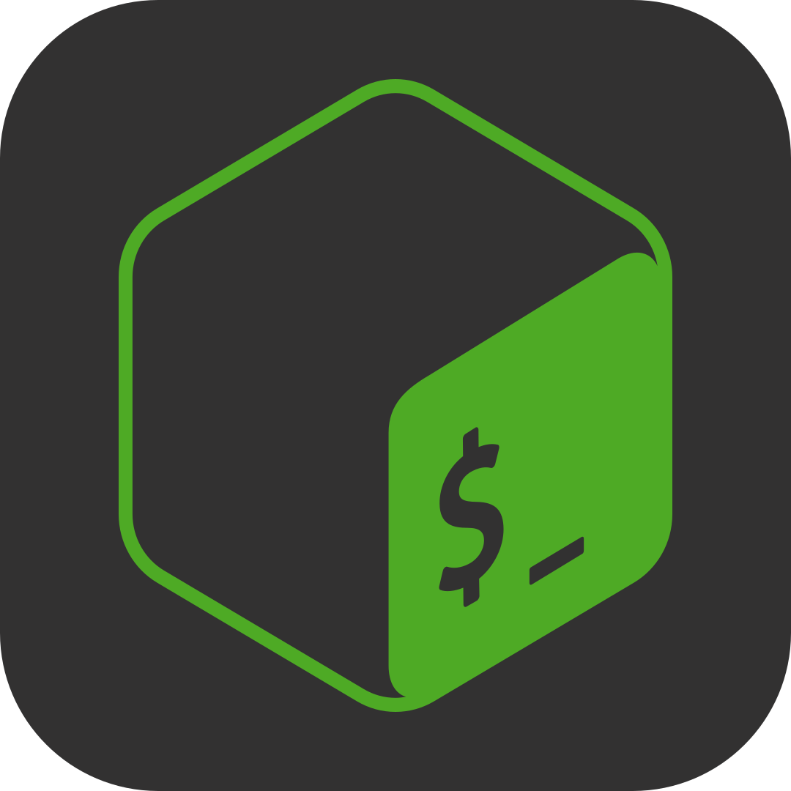
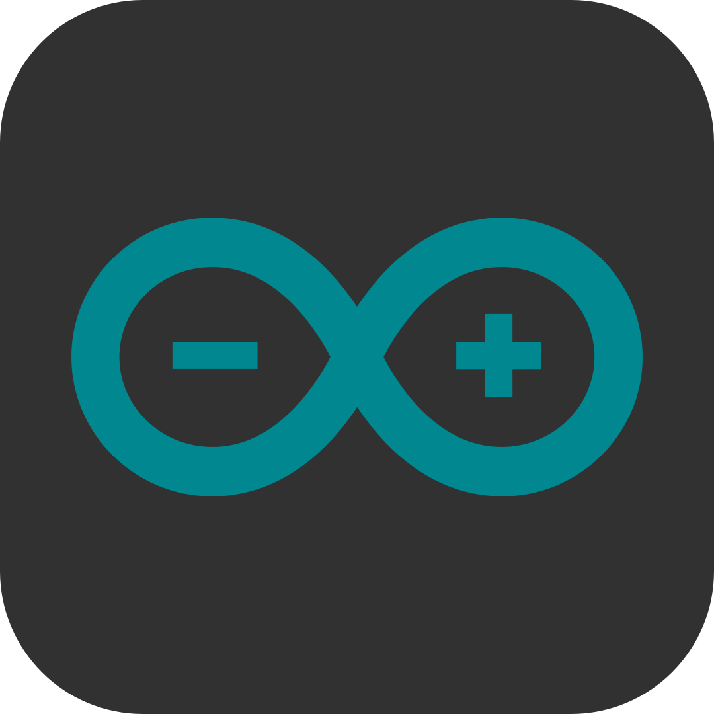
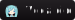

	

# User Learn Badge 

	
	
	
	
	
	
	<!---
	</td></tr></table> 
	--->

## Skill Badge

| Languages | Editing | Software & Technologies |
|-----------|---------|------------------------|
| 
          | 
                | 
                  |

<!---
## Skill Badge

<table border = 3 <table><tr><td valign="top" align="center" width="20%">

### Languages

	
	
	
	
	
	
	
	
	

</td><td valign="top" align="center" width="35%">

### Editing

	
	
	
	
	
	
	
	
	
	
	
	
	
	
	

	
</td><td valign="top" align="center" width="30%">

### Software & Technologies

	
	
	
	
	
	
	
	
	
	
	
	

</td></tr></table>
--->

## Github Stats

 Open GitHub Stats

<tr>
<td> <!-- https://streak-stats.demolab.com/demo/ -->
	 
</td>
<td>
	
	<a href="https://github.com/MirkokriM/42_Common_Core">
                
	
</td>
</tr>

<!---

GUD LUDAA COLOR: ff7788, 50d4c3
--->

## Trophy
 

## 42 Stats

 Open 42 Stats

<!---

--->
	
<!--

 

-->

<!--

Visit the github of this guy!
-->

